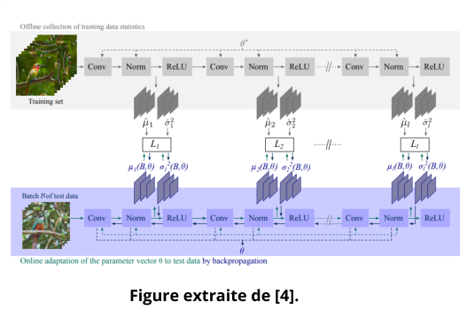

# SelfSupervised-TTT-ImageClassification
TER pour le deuxième semestre du M1 VMI.
## Contexte 
L’apprentissage auto-supervisé vise à apprendre des représentations générales à partir de grandes
quantités de données non annotées. On considérera les images dans ce projet. Ces représentations sont
ensuite spécialisées pour des tâches downstream au moyen d’un fine-tuning supervisé. Dans ce cadre, trois
ensembles de données distincts sont considérés :
1. les données non annotées utilisées lors de la phase d’auto-apprentissage,
2. les données annotées employées pour le fine-tuning supervisé,
3. les données de test, utilisées pour évaluer les performances sur les tâches downstream et,
indirectement, la qualité des représentations apprises en auto-supervision.
Toutefois, ces trois ensembles peuvent suivre des distributions différentes, ce qui entraîne un décalage de
distribution entre les phases d’auto-apprentissage, de fine-tuning et de test, et conduit à une dégradation
des performances. Le Test-Time Training (TTT) [1,2] vise à atténuer ce problème en introduisant une phase
d’adaptation au moment du test, au cours de laquelle le modèle est optimisé directement sur les données
de test, sans accès aux annotations, afin d’adapter le modèle aux conditions réelles d’inférence. Plus
précisément, le modèle d’apprentissage sera adapté individuellement à chaque image de test garantissant
une adaptation fine et locale aux variations de distribution.

## Références
**[1]** Sun, Yu, Xiaolong Wang, Zhuang Liu, John Miller, Alexei Efros, and Moritz Hardt. **"Test-time training with self-supervision for
generalization under distribution shifts."** In International conference on machine learning, pp. 9229-9248. PMLR, 2020.

**[2]** Liu, Yuejiang, Parth Kothari, Bastien Van Delft, Baptiste Bellot-Gurlet, Taylor Mordan, and Alexandre Alahi. **"TTT++: When does
self-supervised test-time training fail or thrive?."** Advances in Neural Information Processing Systems 34 (2021): 21808-21820.

**[3]** Han, Jisu, Jihee Park, Dongyoon Han, and Wonjun Hwang. **"When Test-Time Adaptation Meets Self-Supervised Models."** arXiv
preprint arXiv:2506.23529 (2025).

**[4]** Mirza, Muhammad Jehanzeb, Pol Jané Soneira, Wei Lin, Mateusz Kozinski, Horst Possegger, and Horst Bischof. **"Actmad: Activation
matching to align distributions for test-time-training."** In Proceedings of the IEEE/CVF Conference on Computer Vision and Pattern
Recognition, pp. 24152-24161. 2023.
## Equipe de projet et supervisor
**Étudiants**

- Maksym DOLHOV
- Fallou DIOUF
  
**Superviseurs**

- Ayoub Karine (ayoub.karine@u-paris.fr)
- Camille Kurtz (camille.kurtz@u-paris.fr)
- Laurent Wendling (Laurent.Wendling@u-paris.fr)
## Objectif principal
Construisez et évaluez un pipeline complet basé sur :

- SimCLR pour la pré-formation auto-supervisée
- ViT comme colonne vertébrale de l’encodeur
- CIFAR-10 comme référence principale à petite échelle
- CIFAR-10-C comme référence de test décalé pour la robustesse et l’analyse TTT
- TTT pour l’adaptation en ligne pendant l’inférence
